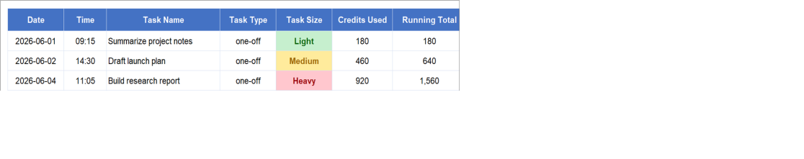

# Copilot Cowork Usage Tracker

`usage-tracker` is a Copilot Cowork skill for recording per-task credit consumption and
reporting weekly and monthly usage. It classifies verified tasks as Light, Medium, or
Heavy and keeps a cumulative running total in an Excel workbook.

## Features

- Logs one workbook row per Cowork task.
- Derives task size from verified credits: Light `<300`, Medium `300-700`, Heavy `>700`.
- Preserves the user's original prompt and current runtime model when available.
- Reports weekly and monthly totals, averages, trends, and task-size breakdowns.
- Records unknown credit values as pending instead of estimating them.
- Uses configurable storage with no personal or tenant-specific values in the skill.

## Install

Copy the repository folder into the skills directory supported by your Copilot Cowork
environment, then enable `usage-tracker`.

On first use, configure:

| Setting | Description |
|---|---|
| `TRACKER_FILE` | OneDrive or SharePoint path/URL of the user's tracker workbook |
| `TRACKER_SHEET` | Worksheet name; defaults to `Usage` |
| `TIMEZONE` | User's IANA timezone |

Do not commit the configured workbook, usage exports, or local settings.

## Example Requests

```text
Log this task with 245 credits.
Track this task's usage; /cost shows 820 credits.
Show my Cowork usage for this week.
Summarize my June 2026 credit consumption.
How many Heavy tasks did I run last month?
```

## Tracker Sheet Sample

All examples below are fictional.



*Excel-rendered view of the core usage columns. Light is green, Medium is amber,
and Heavy is red.*

### Accessible Data Sample

| Date | Time | Task Name | Task Type | Task Size | Credits Used | Running Total | User Prompt | Notes | Model |
|---|---|---|---|---|---:|---:|---|---|---|
| 2026-06-01 | 09:15 | Summarize project notes | one-off | Light | 180 | 180 | Summarize these project notes. | Completed | Example Model A |
| 2026-06-02 | 14:30 | Draft launch plan | one-off | Medium | 460 | 640 | Draft a launch plan for a fictional product. | Completed | Example Model A |
| 2026-06-04 | 11:05 | Build research report | one-off | Heavy | 920 | 1560 | Create a research report using the supplied sample data. | Completed | Example Model B |
| 2026-06-05 | 16:20 | Weekly status digest | recurring |  |  | 1560 | Prepare my weekly status digest. | pending - awaiting credit figure | Example Model A |

## Weekly Summary Sample

**Period:** June 1-7, 2026

| Metric | Total | Light | Medium | Heavy |
|---|---:|---:|---:|---:|
| Tasks | 4 | 1 | 1 | 1 |
| Verified credits | 1560 | 180 | 460 | 920 |

- Average: 520 credits per verified task
- Highest-credit task: Build research report (920)
- Pending tasks: 1
- Previous-week change: Not enough prior data

## Monthly Summary Sample

| Week | Verified Credits |
|---|---:|
| Jun 1-7 | 1560 |
| Jun 8-14 | 1280 |
| Jun 15-21 | 1940 |
| Jun 22-28 | 1110 |
| Jun 29-30 | 390 |
| **June total** | **6280** |

## Repository Privacy

This repository intentionally contains no real tracker workbook, prompts, usage records,
email addresses, usernames, tenant IDs, drive IDs, access tokens, or machine-specific
paths. Sample values are fictional.

## License

MIT
