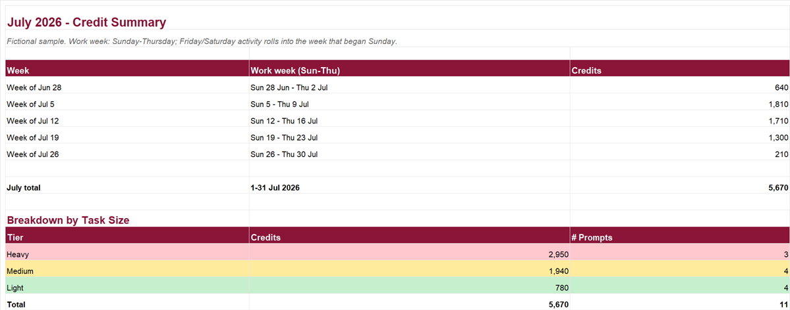

# Copilot Cowork Usage Tracker

`usage-tracker` is a Copilot Cowork skill for recording per-task credit consumption and
reporting weekly and monthly usage. It classifies verified tasks as Light, Medium, or
Heavy and keeps a cumulative running total in an Excel workbook.

## Features

- Logs one workbook row per Cowork task.
- Derives task size from verified credits: Light `<300`, Medium `300-700`, Heavy `>700`.
- Preserves the user's original prompt and current runtime model when available.
- Reports weekly and monthly totals, averages, trends, and task-size breakdowns.
- Records unknown credit values as pending instead of estimating them.
- Uses configurable storage with no personal or tenant-specific values in the skill.

## Install

Copy the repository folder into the skills directory supported by your Copilot Cowork
environment, then enable `usage-tracker`.

On first use, configure:

| Setting | Description |
|---|---|
| `TRACKER_FILE` | OneDrive or SharePoint path/URL of the user's tracker workbook |
| `TRACKER_SHEET` | Worksheet name; defaults to `Usage` |
| `TIMEZONE` | User's IANA timezone |

Do not commit the configured workbook, usage exports, or local settings.

## Example Requests

```text
Log this task with 245 credits.
Track this task's usage; /cost shows 820 credits.
Show my Cowork usage for this week.
Summarize my June 2026 credit consumption.
How many Heavy tasks did I run last month?
```

## Workbook Screenshots

All task and credit data below is fictional. Model labels in the Usage preview match
models recorded by the tracker.

### Usage Tab


*Fictional Excel-rendered Usage tab showing the complete A-J schema end to end. The
header matches the canonical workbook; Light is green, Medium is amber, Heavy is red,
and the Model column uses actual model names.*

### July Credits Tab



*Fictional Excel-rendered July Credits tab, proportioned to the Usage preview, showing
weekly consumption, the monthly total, and credits and prompt counts by task size.*

### Accessible Data Sample

| Date | Time | Task Name | Task Type | Task Size | Credits Used | Running Total | User Prompt | Notes | Model |
|---|---|---|---|---|---:|---:|---|---|---|
| 2026-07-02 | 09:10 | Summarize workshop notes | one-off | Light | 180 | 180 | Summarize these fictional workshop notes. | Completed | Claude Opus 4.8 |
| 2026-07-03 | 14:25 | Draft product launch plan | one-off | Medium | 460 | 640 | Draft a launch plan for a sample product. | Completed | Claude Sonnet 5 (1M context) |
| 2026-07-06 | 11:40 | Build market research report | one-off | Heavy | 920 | 1560 | Create a research report from sample data. | Completed | Claude Opus 4.8 |
| 2026-07-08 | 10:15 | Prepare meeting recap | one-off | Light | 240 | 1800 | Prepare a recap from fictional meeting notes. | Completed | Claude Opus 4.8 |

## Weekly Summary Sample

**Period:** July 5-11, 2026

| Metric | Total | Light | Medium | Heavy |
|---|---:|---:|---:|---:|
| Tasks | 3 | 1 | 1 | 1 |
| Verified credits | 1810 | 240 | 650 | 920 |

- Average: 603.3 credits per verified task
- Highest-credit task: Build market research report (920)
- Pending tasks: 0
- Previous-week change: Not enough prior data

## Monthly Summary Sample

| Week | Verified Credits |
|---|---:|
| Week of Jun 28 | 640 |
| Week of Jul 5 | 1810 |
| Week of Jul 12 | 1710 |
| Week of Jul 19 | 1300 |
| Week of Jul 26 | 210 |
| **July total** | **5670** |

## Repository Privacy

This repository intentionally contains no real tracker workbook, prompts, usage records,
email addresses, usernames, tenant IDs, drive IDs, access tokens, or machine-specific
paths. Sample values are fictional.

## License

MIT
